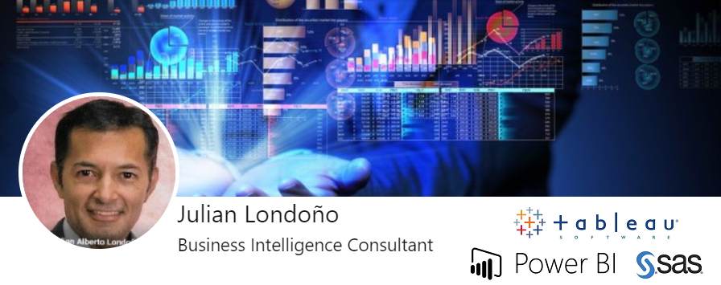

<!--
**julianBI/julianBI** is a ✨ _special_ ✨ repository because its `README.md` (this file) appears on your GitHub profile.
### Hi there 👋
Here are some ideas to get you started:

- 🔭 I’m currently working on ...
- 🌱 I’m currently learning ...
- 👯 I’m looking to collaborate on ...
- 🤔 I’m looking for help with ...
- 💬 Ask me about ...
- 📫 How to reach me: ...
- 😄 Pronouns: ...
- ⚡ Fun fact: ...
-->
- 🔭 System Engineer with experience in Business Intelligence solutions, Management Information Systems.
- I’m currently working on Data Visualization Analysis using (Tableau - Power BI - SAS Viya)

#### Social Network
    

## Tableau Reports ✨

[Public TABLEAU--->](https://public.tableau.com/app/profile/bijulian#!/)

